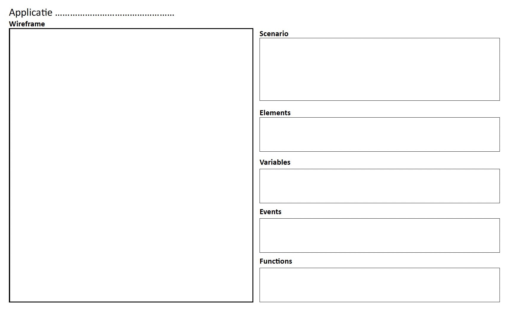

# Getting Started met een plan

Nu je bekend bent met de fundamentele concepten van JavaScript, ben je klaar om je eigen indrukwekkende applicatie te bouwen. Maar hoe start je hiermee? Een handige aanpak is het gebruik van deze [sjabloon](images/opzet-project.pdf). Deze sjabloon helpt je om na te denken over de stappen die je moet nemen en biedt een gestructureerd framework voor je code.

