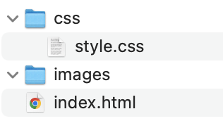

# Getting Started

## Handig om te installeren
Als frontend-developer is het handig om een aantal applicaties te installeren en te gebruiken:
- [VS Code](https://code.visualstudio.com/)
	- [VS Code Live Server](https://marketplace.visualstudio.com/items?itemName=ritwickdey.LiveServer)
	- [VS Code Icons](https://marketplace.visualstudio.com/publishers/vscode-icons-team)
- [Firefox Developer](https://www.mozilla.org/nl/firefox/developer/)

Om een website te bouwen moet je apart mapje aanmaken met een aantal bestanden erin. 
Hoe ziet dat eruit?

- images (map)
- css (map)
	- style.css
- index.html

## HTML
[HTML](https://www.kopstorm.com/blog/wat-is-html-en-hoe-werkt-het) staat voor Hyper Text Markup Language, een programmeertaal die wordt gebruikt voor het schrijven van webpagina's. Hoewel HTML ook deels de vormgeving en styling kan verzorgen, doen we dit meestal met een andere taal: CSS.

## CSS
[Cascading Style Sheets](https://www.kopstorm.com/blog/wat-is-css-en-hoe-werkt-het), afgekort CSS is een programmeertaal die zorgt voor de opmaak van de HTML bestanden.

**Maak deze  met deze bestanden aan.  Weet je niet hoe? Klik [hier](https://www.youtube.com/watch?v=t1eZesWxJFI),**

## Handige bronnen
- [Getting started](https://www.youtube.com/watch?v=t1eZesWxJFI))
- [Wat is HTML en hoe werkt het?](https://www.kopstorm.com/blog/wat-is-html-en-hoe-werkt-het)
- [Wat is HTML?](https://www.youtube.com/watch?v=yr7b3Gt8k-E)
- [W3schools HTML](https://www.w3schools.com/html/)
- [Wat is CSS en hoe werkt het?](https://www.kopstorm.com/blog/wat-is-css-en-hoe-werkt-het)
- [Wat is CSS?](https://www.youtube.com/watch?v=TqT6FHqaHrM)
- [W3schools CSS](https://www.w3schools.com/css/default.asp)