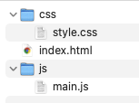
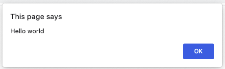

# Getting Started

Maak een webapplicatie met deze mappenstructuur:

- images (map)
- css (map)
	- style.css
- js (map)
	- main.js
- index.html

Zorg ervoor dat aan het index.html de style.css en main.js is gekoppeld. Wanneer dit is gelukt maak je een [alert](https://www.w3schools.com/jsref/met_win_alert.asp) aan waarin je "hello world" laat zien. 

*Zorg ervoor dat je alleen javascript in je javascript bestand hebt staan en niet in je html bestand!*

## Je maakt gebruikt van
- Getting Started [youtube](https://www.youtube.com/watch?v=9B_JTznnV04)
- Alert [w3schools](https://www.w3schools.com/jsref/met_win_alert.asp)
- HTML script src Attribute [w3schools](https://www.w3schools.com/tags/att_script_src.asp)
- HTML link tag [w3schools](https://www.w3schools.com/tags/tag_link.asp)
	
