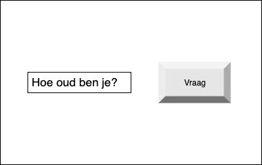

# Vraag het Harrie
Maak een webapplicatie waar je doormiddel van een tekstveld vragen kan stellen. De webapplicatie (Harrie) moet antwoord geven:
- Vraag: Hoe oud ben je? - Antwoord: Ik ben 62 jaar oud
- Vraag: Waar woon je? - Antwoord: In het internet
- Vraag: Wat is je hobby? - Antwoord: YouTube video's bekijken
- Andere vragen.. - Antwoord: Geen idee

Maak gebruik van if/else statements.

## Je maakt gebruikt van:
- variabelen [youtube](https://www.youtube.com/watch?v=A6YVhg9GgPE)
- debuggen & comments [youtube](https://www.youtube.com/watch?v=XUYCOm38SWY)
- DOM en objecten [youtube](https://www.youtube.com/watch?v=k81rBKqwDhU)
- events [youtube](https://www.youtube.com/watch?v=6jYEabxJXxg)
- if else statements [youtube](https://www.youtube.com/watch?v=ndXEEG3kZOU)
- functions [youtube](https://www.youtube.com/watch?v=zC5cvaETdyQ)

## Eventuele uitbreidingen:
- Verzin meer vragen
- Wanneer er een bepaald woord in de vraag zit, dan reageert Harrie daar op.
- Laat de background ook reageren op de vragen
- Voeg geluid eraan toe