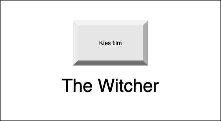

# Film generator
Je zit 's avonds met je kat of partner op de bank. Je hebt al voor de vijfde keer alle afleveringen van 'The Umbrella Academy' gekeken en je wilt iets nieuws kijken. Gelukkig heb je hiervoor een webapplicatie gemaakt. Deze webapplicatie kiest voor jou willekeurig een serie of film. Maak een webapplicatie waardoor je met een druk op een button of door op enter de drukken er willekeurig een film of serie tevoorschijn (kan bijv. met een alert melding) komt. De films en serie komen uit een array:


```javascript
//voorbeeld array
let moviesSeries = ["The Shining", "Emily in Paris", "The Sinner", "Peaky Blinders", "Notting Hill"];
```



## Je maakt gebruikt van
- variabelen [youtube](https://www.youtube.com/watch?v=A6YVhg9GgPE)
- debuggen & comments [youtube](https://www.youtube.com/watch?v=XUYCOm38SWY)
- DOM en objecten [youtube](https://www.youtube.com/watch?v=k81rBKqwDhU)
- events [youtube](https://www.youtube.com/watch?v=6jYEabxJXxg)
- enter event [w3schools](https://www.w3schools.com/howto/howto_js_trigger_button_enter.asp)
- arrays [youtube](https://www.youtube.com/watch?v=Z-l1IAbq3qg)
- random cijfer genereren [w3schools](https://www.w3schools.com/js/js_random.asp)
- alert [w3schools](https://www.w3schools.com/jsref/met_win_alert.asp)
- functions [youtube](https://www.youtube.com/watch?v=zC5cvaETdyQ)

## Eventuele uitbreidingen
- Je kunt een categorie kiezen
- Je laat een plaatje ipv tekst zien 