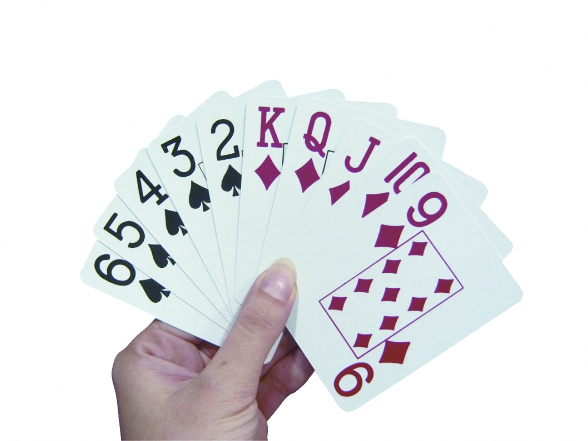
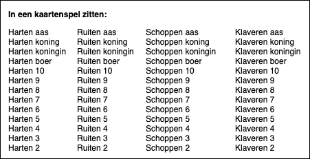

# Kaartspel

Genereer een kaartspel en laat een lijstje met alle kaarten zien. Hiervoor gebruik je twee for-loops en twee arrays. 

## Je maakt gebruikt van
- variabelen [youtube](https://www.youtube.com/watch?v=A6YVhg9GgPE)
- debuggen & comments [youtube](https://www.youtube.com/watch?v=XUYCOm38SWY)
- DOM en objecten [youtube](https://www.youtube.com/watch?v=k81rBKqwDhU)
- functions [youtube](https://www.youtube.com/watch?v=lleIeTMaFRo)
-  loops [youtube](https://www.youtube.com/watch?v=8wJPgDNwxtE)