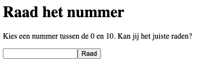

# Raad het nummer

De speler moet een nummer tussen de 0 en 10 kunnen raden. Dit nummer vult de speler in de tekstbox in en met javascript wordt er een willekeurig cijfer gekozen.
Er moet een melding komen of de speler het juiste cijfer heeft gekozen.
Deze melding kan bijvoorbeeld zijn:
- alertbox
- achtergrondkleur aanpassen
- muziekje laten spelen
- iets met animatie?
- score bijhouden?
- enz..

Let op:
- de code moet in een los javascript bestand komen
- maak gebruik van events in het losse javascript bestand, niet in je html bestand

## Je maakt gebruik van
- variabelen [youtube](https://www.youtube.com/watch?v=A6YVhg9GgPE)
- debuggen & comments [youtube](https://www.youtube.com/watch?v=XUYCOm38SWY)
- if else statements  [youtube](https://www.youtube.com/watch?v=ndXEEG3kZOU)
- functions [youtube](https://www.youtube.com/watch?v=lleIeTMaFRo)
- DOM en objecten [youtube](https://www.youtube.com/watch?v=k81rBKqwDhU)
- events [youtube](https://www.youtube.com/watch?v=6jYEabxJXxg)
- random cijfer genereren [w3schools](https://www.w3schools.com/js/js_random.asp)
