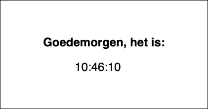

# Digitale klok

Maak een digitale klok die de uren, minuten en secondes aangeven. Deze klok wordt om de seconde door de zelfgemaakte functie _updateClock_ geupdatet. Je gebruikt hiervoor de [getHours](https://www.w3schools.com/jsref/jsref_gethours.asp), getMinutes, getSeconds en de [setInterval methode](https://www.w3schools.com/jsref/met_win_setinterval.asp).

```javascript
//voorbeeld function
function updateClock()
{
	//hier wordt de klok geupdatet
}
```

Breid dit uit door aan te geven of het ochtend, middag, avond of nacht is. Hiervoor moet er if/else statement gebruikt worden (tip: kijk naar de uren).



## Je maakt gebruikt van
- variabelen [youtube](https://www.youtube.com/watch?v=A6YVhg9GgPE)
- debuggen & comments [youtube](https://www.youtube.com/watch?v=XUYCOm38SWY)
- DOM en objecten [youtube](https://www.youtube.com/watch?v=k81rBKqwDhU)
- functions [youtube](https://www.youtube.com/watch?v=lleIeTMaFRo)
- Javascript getHours() method[w3schools](https://www.w3schools.com/jsref/jsref_gethours.asp)
- Javascript getMinutes() method[w3schools](https://www.w3schools.com/jsref/jsref_getminutes.asp)
- Javascript getSeconds() method[w3schools](https://www.w3schools.com/jsref/jsref_getseconds.asp)

## Eventuele uitbreidingen
- voeg er de datum aan toe
- wanneer het een bepaalde datum is, dan...
- maak er een echte klok van!