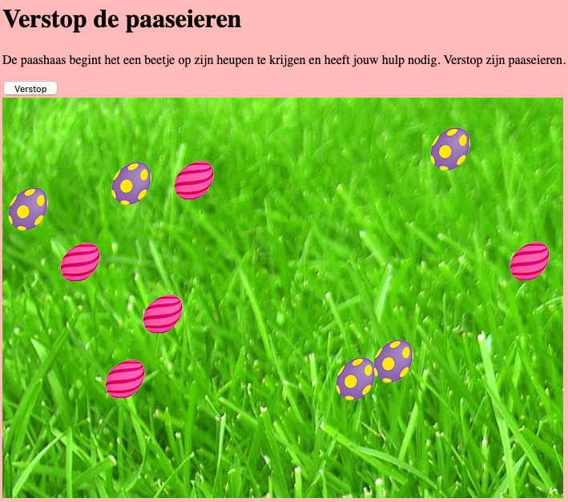

# Verstop de paaseieren

De paashaas begint het een beetje op zijn heupen te krijgen en heeft jouw hulp nodig. Verstop zijn paaseieren. De verschillende soorten paaseieren moeten willekeurig in het speelveld (playfield) terecht komen wanneer op de knop "verstop" geklikt wordt. Wanneer de paaseieren op het speelveld zijn, moeten deze weg te klikken zijn. Breid dit uit met:
- meer soorten paaseieren
- animaties. Wanneer er op een paasei geklikt wordt, gebeurt er iets?
- geluid?
- naast paaseieren ook andere objecten
- houdt een score bij

Let op:
- de code moet in een los javascript bestand komen
- maak gebruik van events in het losse javascript bestand, niet in je html bestand

## Je maakt gebruikt van
- variabelen [youtube](https://www.youtube.com/watch?v=A6YVhg9GgPE)
- debuggen & comments [youtube](https://www.youtube.com/watch?v=XUYCOm38SWY)
- functions [youtube](https://www.youtube.com/watch?v=lleIeTMaFRo)
- DOM en objecten [youtube](https://www.youtube.com/watch?v=k81rBKqwDhU)
- events [youtube](https://www.youtube.com/watch?v=6jYEabxJXxg)
- arrays [youtube](https://www.youtube.com/watch?v=Z-l1IAbq3qg)
- loops [youtube](https://www.youtube.com/watch?v=8wJPgDNwxtE)
- random cijfer genereren [w3schools](https://www.w3schools.com/js/js_random.asp)
- create element [mdn web docs](https://developer.mozilla.org/en-US/docs/Web/API/Document/createElement)

