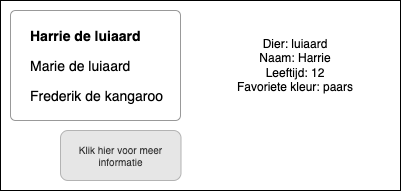

# Dierentuin
Je werkt bij de administratie van Safaripark Beekse Bergen. Het safaripark is onlangs uitgebreid met een luiaarden / kangaroo verblijf. Het is aan jou de taak om de dieren via een applicatie aan de bezoekers te laten zien. De bezoekers komen immers langs lopen en willen graag weten tegen welke luiaard of kangaroo ze praten.



Om dit goed te doen, ga je gebruik maken van [eigen gemaakte objecten](https://www.youtube.com/watch?v=KK8aaXAdcXQ).
Elke dier kan een object zijn. Hoe zou het ongeveer eruit kunnen zien?

```javascript
let harrie = {
   soort: "luiaard",
   naam: "Harrie",
   leeftijd: 12,
   kleur: "paars"
};
```

Maak voor elke dier een eigen object aan.
Wanneer je voor elk dier een object hebt gemaakt, moet je deze weergeven op de website. Je zou dit bijvoorbeeld kunnen doen met een list, createElement en appendChild.

```html
<!-- voorbeeld van een lege list -->
<ul id="dieren">
</ul>
```

```javascript
const dierenlijst = document.querySelector("#dieren");

let harrie = {
   soort: "luiaard",
   naam: "Harrie",
   leeftijd: 12,
   kleur: "paars"
};

let dier = document.createElement("li");
dier.innerHTML = harrie.naam; //dit komt uit het harrie-object
dierenlijst.appendChild(dier); //hier wordt harrie toegevoegd aan de lijst
```

Als laatste zou het natuurlijk mooi zijn wanneer dat je op het dier klikt (in de li lijst) er detail informatie tevoorschijn zou komen. Dit kan je doen met een addEventListener.

```javascript
const dierenlijst = document.querySelector("#dieren");
const dierendetail = document.querySelector("#details");

let harrie = {
   soort: "luiaard",
   naam: "Harrie",
   leeftijd: 12,
   kleur: "paars"
};

let dier = document.createElement("li");
dier.innerHTML = harrie.naam; //dit komt uit het harrie-object

//ADDEVENTLISTENER
dier.addEventListener("click", function() {
   dierendetail.innerHTML = harrie.naam + ", " harrie.soort
});

dierenlijst.appendChild(dier); //hier wordt harrie toegevoegd aan de lijst
```

Breid de applicatie uit met meer dieren. En als je helemaal blits wil doen: gebruik een forEach en maak een function aan in het harrie object.

## Je maakt gebruikt van
- Eigen object [youtube](https://www.youtube.com/watch?v=KK8aaXAdcXQ))
- De DOM en Objecten [youtube](https://www.youtube.com/watch?v=k81rBKqwDhU)
- Variabelen [youtube](https://www.youtube.com/watch?v=A6YVhg9GgPE)
- Events [youtube](https://www.youtube.com/watch?v=6jYEabxJXxg)
- Functions [youtube](https://www.youtube.com/watch?v=lleIeTMaFRo)
- Javascript HTML DOM EventListener [w3schools](https://www.w3schools.com/js/js_htmldom_eventlistener.asp)