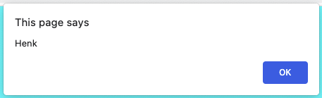

# Hello Naam!


## Let
Maak een webapplicatie waarin je een naam-variabele met waarde Henk aanmaakt/declareert. Deze variabele laat je zien in een alert.

```javascript
let naam = "Henk";
alert(naam);
```



Breid de melding uit met "Hello Henk". Je moet hiervoor het + teken gebruiken. "Hello" mag niet bij de naam variabele gezet worden.


Als je een "let"-variabele declareert, kan je deze ook aanpassen. Bijvoorbeeld:
```javascript
let naam = "Henk"; //hier declareer je de variabele 'naam' 
naam = "Truus"; //hier pas je de variabele 'naam' aan
```

Breid je "Hello Henk" applicatie uit, waar je eerst "Hello Henk" in een alert ziet en daarna "Hello Truus" in een alert ziet. 

## Const
Een "const"-variabele is een ander type variabele. Const is de afkorting van **constant**. 

```javascript
const naam = "Henk";
```

Dit betekent dat je de variabele kan aanmaken, maar niet meer kan aanpassen.  

```javascript
const naam = "Henk"; 
naam = "Truus" //dit kan dus niet!
```

Een const wordt vaak gebruikt om items uit een website op te halen of functions de declareren. Hier later meer over!

## Var
Var is een oude manier van variabelen aanmaken. Als je dit ziet, roep dan: GO BACK TO DE ZEROS, STUPID MILENNIAL HIPSTER!

## Je maakt gebruikt van
- Getting Started [youtube](https://www.youtube.com/watch?v=9B_JTznnV04)
- Variabelen [youtube](https://www.youtube.com/watch?v=A6YVhg9GgPE)
- Variabelen [w3schools](https://www.w3schools.com/js/js_variables.asp)
- Net Ninja - Modern Javascript Tutorial - Syntax Basics & Types [youtube](https://www.youtube.com/watch?v=FhguwBJeqWs)
- Alert [w3schools](https://www.w3schools.com/jsref/met_win_alert.asp)
- Adding name [w3schools](https://www.w3schools.com/js/tryit.asp?filename=tryjs_variables_add_strings)