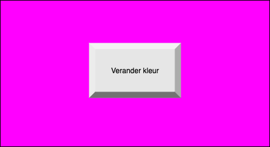

# Background generator
Maak een webapplicatie waardoor je op een button te klikken of enter in te drukken de achtergrond van kleur verandert. 
In plaats van hex colors gebruik je hiervoor [RGB colors](https://www.w3schools.com/colors/colors_rgb.asp). RGB colors bestaan uit cijfers en die kunnen [willekeurig](https://www.w3schools.com/js/js_random.asp) gegenereerd worden.  

## Je maakt gebruikt van
- variabelen [youtube](https://www.youtube.com/watch?v=oTKpXoqZims)
- debuggen & comments [youtube](https://www.youtube.com/watch?v=XUYCOm38SWY)
- DOM en objecten [youtube](https://www.youtube.com/watch?v=k81rBKqwDhU)
- events [youtube](https://www.youtube.com/watch?v=6jYEabxJXxg)
- enter event [w3schools](https://www.w3schools.com/howto/howto_js_trigger_button_enter.asp)
- random cijfer genereren [w3schools](https://www.w3schools.com/js/js_random.asp)
- RGB colors [w3schools](https://www.w3schools.com/colors/colors_rgb.asp)
- functions [youtube](https://www.youtube.com/watch?v=zC5cvaETdyQ)

## Eventuele uitbreidingen
- Naast een kleur kan de achtergrond ook een plaatje zijn. Dit plaatje komt uit een array.
- De achtergrondkleur verandert om de 30 seconde [setInterval](https://www.w3schools.com/jsref/met_win_setinterval.asp)
