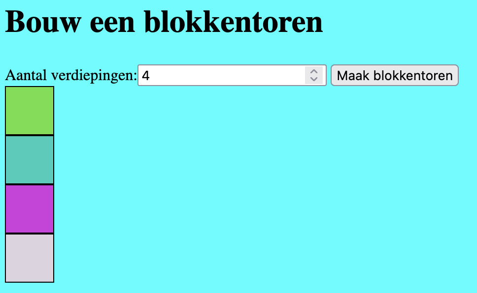

# Blokkentoren

Maak een webapplicatie waarmee je een blokkentoren kan genereren. De gebruiker moet kunnen aangeven hoeveel verdiepingen de blokkentoren heeft. Daarna kan de gebruiker op een genereer knopje drukken en de blokkentoren wordt gegenereerd. Er wordt steeds 1 blokje op elkaar gestapeld. Voor elk blokje wordt een achtergrond kleur gegenereerd.



Om de blokjes netjes op elkaar te stapelen is het handig om in je html een blocktower (id) div te hebben. In deze blocktower div worden block divs (classes) gegenereerd.

```html
<div id="blocktower">
	<!-- deze blocks worden met javascript gegenereerd -->
	<div class="block"></div>
	<div class="block"></div>
	<div class="block"></div>
	....
	<!-- deze blocks worden met javascript gegenereerd -->
</div>
```

Daarnaast moet je zorgen dat de blocks boven elkaar worden gestapeld. Dit zou je bijv. met flexboxen in je css kunnen doen.

```css
#blocktower {
	display: flex;
	justify-content: center;
	flex-wrap: wrap;
	width: 50px;
}

.block {
	width: 48px;
	height: 48px;
	border: 1px solid #000000;
}
```

Genereer eerst de blokjes zonder achtergrondkleur. Je zou gebruik kunnen maken van een for loop om de blokjes te laten genereren. 
Om de achtergrond kleur aan te passen, zou je naar de [Background generator](../niveau1/BackgroundGenerator.md) opdracht kunnen kijken.

## Je maakt gebruikt van
- variabelen [youtube](https://www.youtube.com/watch?v=HfWaYjRrIM4)
- debuggen & comments [youtube](https://www.youtube.com/watch?v=XUYCOm38SWY)
- DOM en objecten [youtube](https://www.youtube.com/watch?v=k81rBKqwDhU)
- functions [youtube](https://www.youtube.com/watch?v=zC5cvaETdyQ)
-  loops [youtube](https://www.youtube.com/watch?v=8wJPgDNwxtE)
-  random number [w3schools](https://www.w3schools.com/js/js_random.asp)
-  createElement [w3schools](https://www.w3schools.com/jsref/met_document_createelement.asp)
-  background generator opdracht [Background generator](../niveau1/BackgroundGenerator.md) 

## Eventuele uitbreidingen
- ipv achtergrond een achtergrond plaatje
- maak er een piramide van
- je kunt de blokjes wegklikken