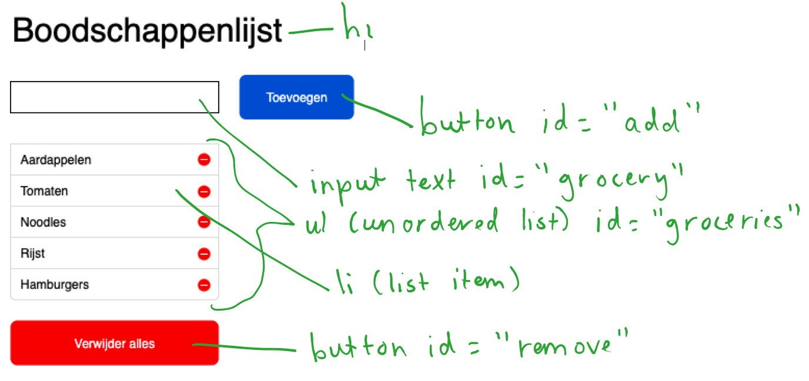

# Boodschappenlijst

Maak een werkende boodschappenlijst met html, css en javascript. Gebruik hiervoor het voorbeeld dat hieronder staat.

## Stappenplan
1. Zet eerst alles om in html en css. In het voorbeeld staan suggesties welke elementen en welke id's eraan gegeven kunnen worden. Hier kan je natuurlijk ook zelf een keuze in maken.
2. Wanneer je alles hebt omgezet. Ga je aan de slag met javascript. Zet het javascript in een apart javascript bestand (main.js). 
3. Er kunnen vier functionaliteiten toegevoegd worden:
	1. **_Toevoegen van een boodschap - niveau *_**
		1. Gebruiker voert boodschap in
		2. Gebruiker drukt op toevoegen
		3. Systeem voegt aan groceries lijst boodschap toe
	2. **_Alle boodschappen verwijderen - niveau *_**
		1. Gebruiker klikt op "alles verwijderen"
		2. Systeem verwijdert alle boodschappen
	3. **_Verwijderen van 1 boodschap - niveau **_**
		1. Gebruiker klikt op remove-knop
		2. Systeem verwijdert boodschap
	4. **_Veranderen van 1 boodschap - niveau ***_***
		1. Gebruiker klikt op aanpas knop (let op deze staat nog niet in het ontwerp)
		2. Systeem laat tekst boodschap in input veld zien
		3. Gebruiker past boodschap aan
		4. Gebruiker klikt op button om het aan te passen
		5. Systeem past boodschap aan

## Je maakt gebruikt van
- CSS ul [w3schools](https://www.w3schools.com/css/css_list.asp)
- HTML input [w3schools](https://www.w3schools.com/tags/tag_input.asp)
- Document loaden [w3schools](https://javascript.info/onload-ondomcontentloaded)
- DOM en Objecten [youtube](https://www.youtube.com/watch?v=k81rBKqwDhU&list=PLMtxBdV6mf-6WBtPVVn3sAfohEmhv9JlM&index=9)
- Events [youtube](https://www.youtube.com/watch?v=6jYEabxJXxg&list=PLMtxBdV6mf-6WBtPVVn3sAfohEmhv9JlM&index=11)
- Functions [youtube]https://www.youtube.com/watch?v=lleIeTMaFRo)
- Scoping [youtube](https://www.youtube.com/watch?v=CD1prUUhisI&list=PLMtxBdV6mf-6WBtPVVn3sAfohEmhv9JlM&index=12)
- Creating element [w3schools](https://www.w3schools.com/js/js_htmldom_nodes.asp)
- Input Text value Property [w3schools](https://www.w3schools.com/jsref/prop_text_value.asp)
