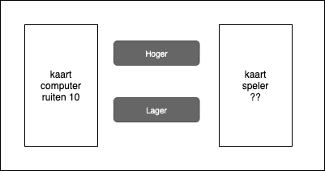
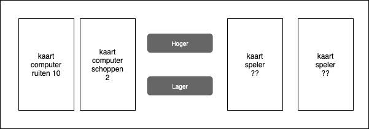

# Kaartenspel Hoger of Lager Dan

Maak een webapplicatie-kaartspel waarbij je moet raden of jouw getrokken kaart hoger of lager dan de getrokken kaart van de computer is. Er wordt een scores bijgehouden met juist geraden, niet juist geraden en gelijk-aantal (dezelfde kaart) geraden.

Maak gebruik van het gehele kaartendek behalve de joker. Er hoeft niet gekeken te worden naar de soort (harten, ruiten, schoppen of klaveren) kaart. De aas heeft 11 punten, de koning en koningin 10 punten en de boer 9 punten. De rest heeft de punten aantallen die op de kaart staan.

Maak eerst een stappenplan hoe deze applicatie moet werken. Maak daarna de applicatie. 

Klaar? Breid de applicatie uit met 2 kaarten. Zorg ervoor dat de kaarten bij elkaar worden opgeteld.

## Je maakt gebruikt van
- variabelen [youtube](https://www.youtube.com/watch?v=HfWaYjRrIM4)
- debuggen & comments [youtube](https://www.youtube.com/watch?v=XUYCOm38SWY)
- DOM en objecten [youtube](https://www.youtube.com/watch?v=k81rBKqwDhU)
- functions [youtube](https://www.youtube.com/watch?v=zC5cvaETdyQ)
- events [youtube](https://www.youtube.com/watch?v=6jYEabxJXxg)
- arrays [youtube](https://www.youtube.com/watch?v=Z-l1IAbq3qg)
- random cijfer genereren [w3schools](https://www.w3schools.com/js/js_random.asp)
- create element [mdn web docs](https://developer.mozilla.org/en-US/docs/Web/API/Document/createElement)
- zipje van kaarten [google storage](https://storage.googleapis.com/google-code-archive-downloads/v2/code.google.com/vector-playing-cards/PNG-cards-1.3.zip)