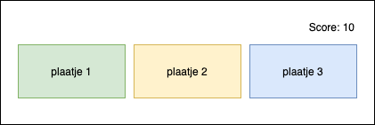

# Wie van de drie?
Maak een Wie van de drie webapplicatie. Bij deze webapplicatie heb je drie plaatjes en onder 1 van de drie plaatjes zit de joker verstopt. De speler kan op de plaatjes klikken. 

Wanneer de speler op het plaatje klikt waaronder de joker klikt, krijgt de speler een punt. Wanneer de speler op een plaatje klikt waar geen joker zit, gaat er een punt vanaf.
De joker verandert willekeurig van positie wanneer er op een plaatje wordt geklikt.

## Je maakt gebruikt van
- variabelen [youtube](https://www.youtube.com/watch?v=A6YVhg9GgPE)
- debuggen & comments [youtube](https://www.youtube.com/watch?v=XUYCOm38SWY)
- DOM en objecten [youtube](https://www.youtube.com/watch?v=k81rBKqwDhU)
- events [youtube](https://www.youtube.com/watch?v=6jYEabxJXxg)
- random cijfer genereren [w3schools](https://www.w3schools.com/js/js_random.asp)
- functions [youtube](https://www.youtube.com/watch?v=zC5cvaETdyQ)