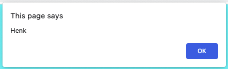
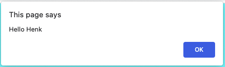

# Hello Naam!

Maak een webapplicatie waarin je een naam-variabele met waarde Henk aanmaakt. Deze variabele laat je zien in een alert.

```javascript
let naam = "Henk";
```



Breid de melding uit met "Hello Henk". Je moet hiervoor het + teken gebruiken. "Hello" mag niet bij de naam variabele gezet worden.



## Je maakt gebruikt van
- Getting Started [youtube](https://www.youtube.com/watch?v=9B_JTznnV04)
- Variabelen [youtube](https://www.youtube.com/watch?v=HfWaYjRrIM4)
- Variabelen [w3schools](https://www.w3schools.com/js/js_variables.asp)
- Alert [w3schools](https://www.w3schools.com/jsref/met_win_alert.asp)
- Adding name [w3schools](https://www.w3schools.com/js/tryit.asp?filename=tryjs_variables_add_strings)