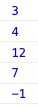

# Rekensom

Maak de twee variabelen cijfer1 en cijfer 2 aan. Geef cijfer1 een waarde van 3 en cijfer2 een waarde van 4.
```javascript
let cijfer1 = 3;
let cijfer2 = 4;
```

Laat in de console eerst de waarde van cijfer1 en daarna de waarde van cijfer2 zien.


Maak daarna een nieuwe variabele uitkomst1 aan. In deze variabele moet de berekening cijfer1 * cijfer2 gemaakt worden.
Laat uitkomst1 (12) ook in de console zien.


Maak nog de twee variabele uitkomst2 en uitkomst3 aan. Maak hier de berekening cijfer1 + cijfer2 (7) en cijfer1 - cijfer2 (-1). Laat dit weer in de console zien.



## Je maakt gebruikt van
- Getting Started [youtube](https://www.youtube.com/watch?v=9B_JTznnV04)
- Variabelen [youtube](https://www.youtube.com/watch?v=oTKpXoqZims)
- HTML DOM console.log() method [w3schools](https://www.w3schools.com/jsref/met_console_log.asp)